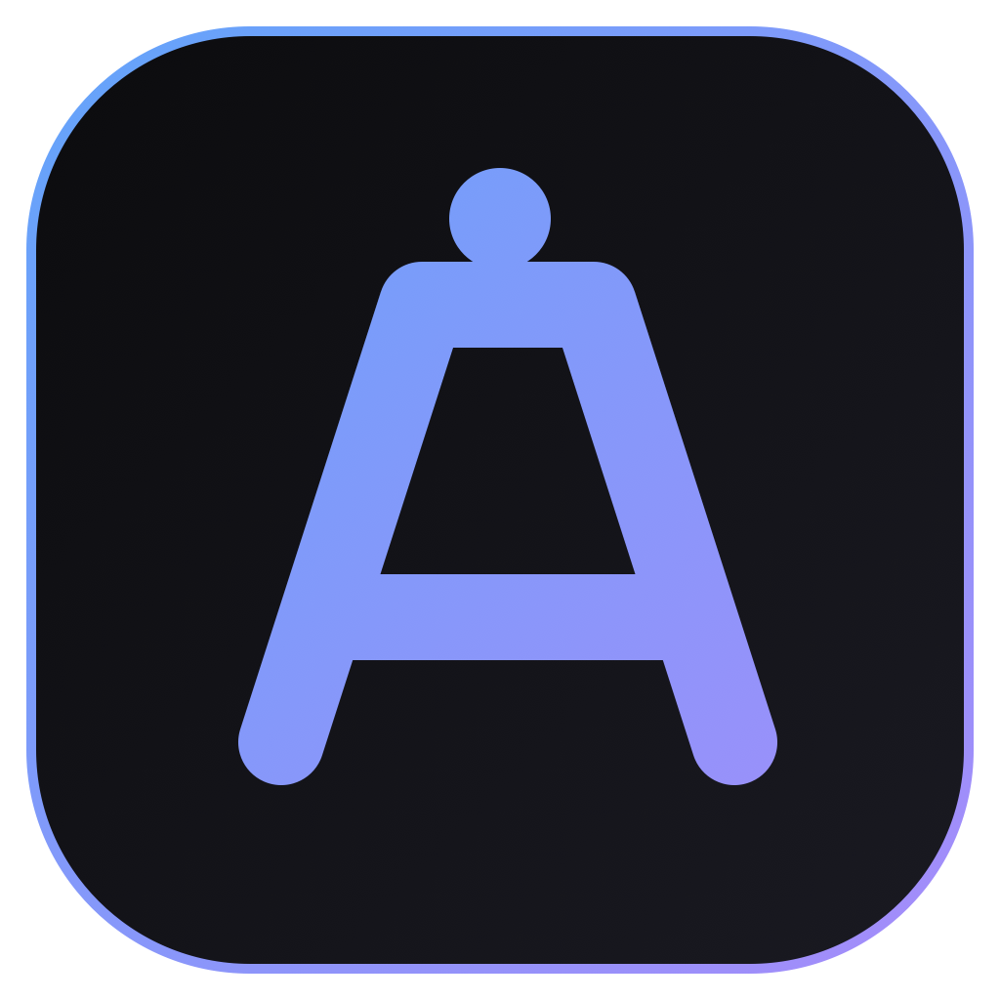

<div align="center">
  <br>
  
  <h1>Alby — the control room for your AI coding agents</h1>
  <p>
    <strong>Run Claude Code, Gemini and Codex across every server you own — from one window.</strong>
  </p>

  <p>
    <a href="https://github.com/alby-sh/alby/releases/latest"></a>
  </p>

  <p>
    <a href="https://alby.sh"></a>
    <a href="https://github.com/alby-sh/alby/blob/main/LICENSE"></a>
    
    
  </p>
</div>

---

## What is Alby?

Alby is a native macOS desktop app that lets you **spawn, monitor and orchestrate dozens of AI coding agents in parallel** across all your remote SSH servers and local folders — from a single window.

Every agent you launch runs inside a `tmux` session on the target machine, so your work survives disconnects, sleeps, and crashes. Close the app, reboot your Mac, log in from another device — your sessions are still there, exactly where you left them.

## ✨ Key capabilities

- **Run 10+ agents in parallel** — Claude Code, Gemini, Codex, or any other terminal-based CLI
- **Persistent tmux-backed sessions** that survive disconnects, sleeps and restarts
- **Live cross-device sync** — pick up exactly where you left off from any Mac you're logged into
- **Local + remote, side by side** — mix SSH boxes and local folders in the same workspace
- **Scheduled routines** — cron-like recurring agent runs (nightly audits, daily triage, etc.)
- **Shared with your team** — create teams, invite members, share projects with granular access
- **Encrypted SSH key vault** — bring your keys once, access all your servers from any device
- **Full audit log** — who changed what, when, on which environment, with 1-year retention
- **Git integration** — status, diff, commit + push, GitHub auth via `gh` — without leaving the app

## 📥 Download for macOS

> [**→ Download the latest .dmg from the releases page**](https://github.com/alby-sh/alby/releases/latest)

Currently shipping Apple Silicon (arm64) builds. Intel (x64) support coming next release.

Builds are **signed with an Apple Developer ID and notarized by Apple**. Just
double-click the `.dmg`, drag Alby to Applications, and launch it — no
warnings, no workarounds. Then sign in with Google, Microsoft, or email
(OTP-verified) and you're in.

## 🧠 Supported agents

Alby works with any terminal-based AI CLI. First-class support and configuration for:

| Agent | Install hint |
|---|---|
| **Claude Code** | `npm install -g @anthropic-ai/claude-code` |
| **Gemini CLI** | `npm install -g @google/gemini-cli` |
| **Codex** | `npm install -g @openai/codex` |
| **Plain terminal** | Always works, zero config |

## 🛠 Requirements

**On your Mac (running the app):**
- macOS 13+
- (Only if building from source) Node.js ≥ 20

**On each remote server you connect to:**
- `tmux` (required — agent sessions are managed via tmux)
- The agent CLIs you want to run (`claude`, `gemini`, `codex`)
- Optional: `gh` (GitHub CLI) for in-app GitHub auth/commit/push

Remote servers are connected via your existing `~/.ssh/config` — no extra setup needed.

## 🚀 Install from source

```bash
git clone https://github.com/alby-sh/alby.git
cd alby
npm install
npm run dev            # development mode
npm run package        # build a .dmg for your current architecture
```

## 🏗 Architecture

```
src/
├── main/        Electron main process: SQLite cache, SSH pool, tmux, IPC, cloud client
│   ├── agents/  Agent lifecycle (local + remote), routine scheduler
│   ├── auth/    OAuth loopback flow, keychain token storage
│   ├── cloud/   HTTP client for the alby.sh REST API, data migration
│   ├── db/      better-sqlite3 local cache repos
│   ├── ssh/     ssh2-based connection pool, ~/.ssh/config parser
│   └── ipc/     IPC surface exposed to the renderer
├── preload/     contextBridge — the only code that sees `ipcRenderer`
├── renderer/    React 19 + Tailwind 4 + zustand UI
│   └── stores/  auth, sync (Reverb/pusher-js), online, app state
└── shared/      Types shared between main and renderer
```

All privileged operations (SQLite, SSH, spawning processes, OAuth) live in `main`. The renderer talks through a typed IPC bridge exposed in `preload/index.ts`.

Live sync uses [Laravel Reverb](https://reverb.laravel.com/) (Pusher-compatible WebSocket) on the backend, consumed via `pusher-js` in the renderer. When a teammate edits a project, you see it in <1 second.

## 🔒 Security notes

- `contextIsolation: true`, `nodeIntegration: false`
- The renderer has **no direct filesystem, network, or Node access** — every capability goes through a narrow, typed IPC surface
- The desktop app stores only your Sanctum API token, in the **macOS Keychain** (via `keytar`). Never in the SQLite file.
- SSH private keys stay in your existing `~/.ssh/` directory. If you opt in to the encrypted cloud vault, they are sealed with **AES-256-GCM** before leaving your machine.
- The local SQLite database is a cache of the cloud data and lives in Electron's `userData` directory.

## 📡 Monitoring

This app ships the [Alby issue detector](https://alby.sh) (`@alby-sh/report`) in the Electron main process (`src/main/index.ts`). Uncaught exceptions and unhandled rejections are forwarded to our Alby project automatically.

The DSN is hard-coded (it's public by design), but the `environment` tag is read from the `ALBY_ENVIRONMENT` environment variable so each deploy stage files events under its own bucket. Set it in whatever `.env` / launch-script your stage uses:

| Stage | `ALBY_ENVIRONMENT` value |
|---|---|
| Local dev | `Local` |
| Staging | `Staging` |
| Production | `Production` |

If `ALBY_ENVIRONMENT` is unset the SDK falls back to `development`. The `release` tag is read from `package.json` via `app.getVersion()` so Alby can auto-resolve issues across releases.

## 🤝 Contributing

Issues and PRs are welcome. See [CONTRIBUTING.md](CONTRIBUTING.md) for the dev workflow, coding conventions, and how to propose changes. All contributors are expected to follow the [Code of Conduct](CODE_OF_CONDUCT.md).

## 📜 License

[Business Source License 1.1](LICENSE) © 2026 **Alberto Pisaroni**

Non-production use is free. A commercial license is required to run Alby as a competing service (anything that offers orchestration of AI coding agents to third parties). On **2030-04-22** (or four years after first public release, whichever comes first) the code converts to Apache-2.0. Full terms in [LICENSE](LICENSE).

## ⚖️ Trademarks

Claude and Claude Code are trademarks of Anthropic, PBC. Gemini is a trademark of Google LLC. Codex is a trademark of OpenAI. This project is not affiliated with, endorsed by, or sponsored by Anthropic, Google, or OpenAI — it is an independent open-source client for running those CLIs.
